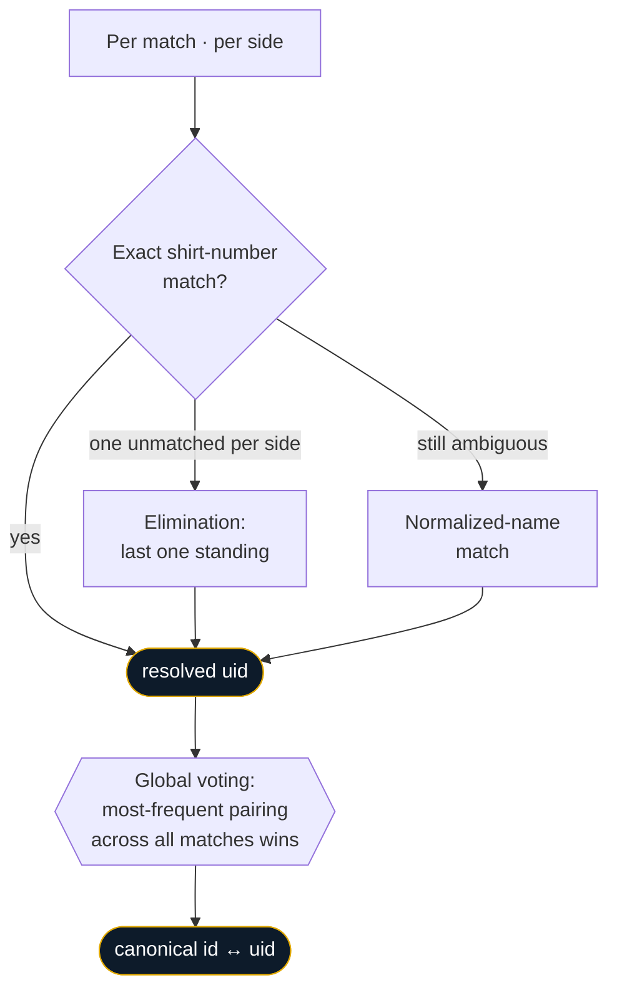
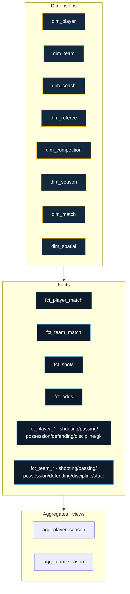
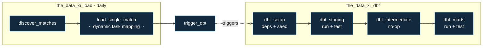
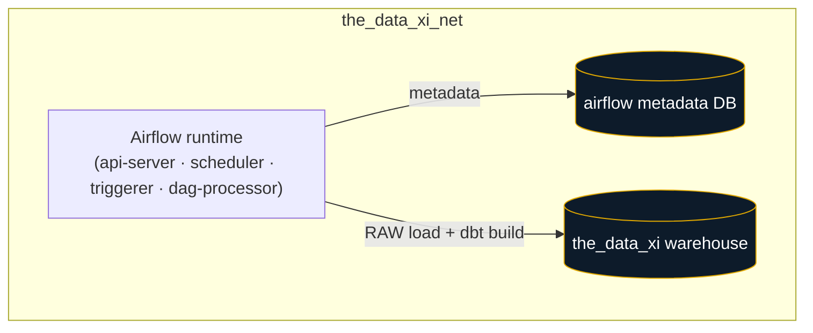

<p align="center">
  
</p>

<h1 align="center">The Data XI</h1>

<p align="center">
  <b>A production-grade football analytics data platform.</b><br/>
  Multiple independent providers, reconciled into one clean, conformed model.
</p>

<p align="center">
  
  
  
  
  
</p>

---

## Table of Contents

- [What is The Data XI?](#what-is-the-data-xi)
- [Why it's hard (and what makes it good)](#why-its-hard-and-what-makes-it-good)
- [Architecture at a glance](#architecture-at-a-glance)
- [Data sources](#data-sources)
- [The pipeline](#the-pipeline)
  - [1 · Ingestion](#1--ingestion)
  - [2 · RAW layer](#2--raw-layer)
  - [3 · Identity resolution — the crosswalk system](#3--identity-resolution--the-crosswalk-system)
  - [4 · Staging layer](#4--staging-layer)
  - [5 · Marts layer](#5--marts-layer)
- [Shot alignment: one key across providers](#shot-alignment-one-key-across-providers)
- [Orchestration](#orchestration)
- [Data quality & testing](#data-quality--testing)
- [Infrastructure](#infrastructure)
- [Project structure](#project-structure)
- [Getting started](#getting-started)
- [Tech stack](#tech-stack)
- [Roadmap](#roadmap)

---

## What is The Data XI?

The Data XI is a football analytics platform built on a real data-engineering backbone: a
multi-provider ingestion and transformation pipeline that turns collected match data into a
clean, conformed, analytics-ready warehouse.

Collection began with the **2018/19 season across the top-5 European leagues and the UEFA
Champions League**, and is designed to grow — more leagues and future seasons are added over
time. Data is drawn from **several independent providers** (one for odds, the others for
comprehensive match data) and reconciled into a single dimensional model: one identity per
player, per team, per coach, per referee, no matter which provider a stat came from.

Pulling from multiple providers is a deliberate resilience and completeness choice — no single
feed is a point of failure, and where providers disagree, the model picks a defined
source-of-truth rather than blindly blending.

The goal is depth and trustworthiness beyond the public tools: not just *what* happened in a
match, but the event-level texture (shot-creating actions, possession sequences, pressing
intensity, game-state splits) wired to expected goals and odds, all queryable through a stable
star schema.

---

## Why it's hard (and what makes it good)

Combining football providers is deceptively painful. Each one names players differently, IDs
them differently, orders events differently, and disagrees at the edges. The interesting
engineering in this project is the reconciliation:

- **One conformed match key** stamped on every row from every provider, at ingestion.
- **An anchored identity system** that resolves the secondary providers' player/team/coach IDs
  back to a single canonical `*_uid`, using shirt numbers, an elimination ladder, name
  normalization, and cross-match voting — never a brittle name match alone.
- **A shared shot key** that lets the providers' shotmaps join cleanly, so event-level
  shot-creating actions sit next to expected-goals values on the same row.
- **An auto-extending loader** that absorbs the providers' ever-changing wide stat blocks
  without a schema migration on every season.

The result is a warehouse where a question like *"this player's progressive passes per 90,
percentile-ranked against same-position peers in his league-season"* is a single query.

---

## Architecture at a glance

```mermaid
flowchart LR
    subgraph SRC[Providers]
        P1[Event data]
        P2[Expected goals]
        P3[Ratings & reference]
        P4[Odds]
    end
    SRC -->|collectors| FIX[(Collected match data · on disk)]
    FIX -->|parsers + auto-extending loader| RAW[(RAW · provider-native landing)]
    RAW -->|dbt · staging views| STG[[STAGING · conformed + crosswalks]]
    STG -->|dbt · marts| MARTS[(MARTS · star schema)]
    MARTS -->|read API · planned| APP[Intelligence modules + web]

    classDef store fill:#0d1b2a,stroke:#e0a800,color:#fff;
    class RAW,MARTS,FIX store;
```



Three transformation tiers, each with a clear contract:

| Tier | Materialization | Purpose |
|---|---|---|
| **RAW** | tables | Provider-native landing zone. One row per provider event/entity, match key stamped. Lossless. |
| **STAGING** | views (+ crosswalk tables) | Type-cast, renamed, identity-attached. Zero storage; the conformance layer. |
| **MARTS** | tables (+ aggregate views) | Dimensional star schema. The query surface. |

---

## Data sources

Data is reconciled from several independent providers. They are not redundant — they are
complementary, and each has a defined **role**. The design picks a source-of-truth per field
rather than averaging providers together. Providers are referred to by role throughout.

| Role | Contributes |
|---|---|
| **Event provider** *(identity anchor)* | Touch-level events, passing (+advanced), defending, possession sequences, shooting with **shot-creating actions**, game-state context. Its native IDs are the canonical anchor. |
| **Expected-goals provider** | **xG / xGOT**, wide team match stats, granular player positions, momentum, match colours. |
| **Reference-data provider** | Player **match ratings**, entity master data (managers, referees, competitions, seasons), shotmaps, spatial (heatmaps, average positions). |
| **Odds provider** | Decomposed pre-match & in-play markets (1X2, Asian handicap, player props, …). |

---

## The pipeline

### 1 · Ingestion

Match data is collected per-provider and lands on disk, organised by fixture. Ingestion is
**discovery-driven**: the load DAG scans the collection tree, diffs it against what's already in
the warehouse, and only processes new matches — unless `force_reload` is set, which reprocesses
everything (used after a parser or schema change).

### 2 · RAW layer

Per-provider parsers transform each match into typed rows, and a single **auto-extending
loader** pushes them to the `raw` schema — a landing table per provider entity, namespaced by
provider. Key properties of the loader:

- **Match key everywhere** — the conformed match key is injected on every row at load time.
- **Auto-extend** — any column a parser emits that doesn't exist yet is added to the table on
  the fly, so the providers' season-varying wide stat blocks land without migrations.
- **Idempotent** — natural-key tables upsert; keyless event tables (shots, sequences) are
  delete-by-match then re-insert, so a reload is always clean.

### 3 · Identity resolution — the crosswalk system

This is the heart of the project. Every provider IDs players and teams differently; the marts
need **one** identity. The system is **anchored on the event provider**: that provider's native
player and team IDs *become* the canonical `player_uid` / `team_uid` (no hashing).

The other providers' IDs are resolved back to that anchor by a deterministic ladder, keyed on
`(match, side, shirt number)` — the one attribute all providers share per match:



- **Shirt → elimination → name**, then **global voting** overrides any single bad match (if a
  player wore the wrong number once, the majority pairing still wins).
- **Coaches** have no event-provider anchor, so `dim_coach` doubles as its own crosswalk between
  the two enrichment providers, resolved per match via the same home/away trick.
- **Referees** anchor on the reference-data provider's referee ID.

Alias-override seeds provide a manual escape hatch for the rare unresolvable case.

### 4 · Staging layer

Materialized as **views** (zero storage — no RAW duplication):

- **A `stg_*` view per RAW table** — type-cast (TEXT → numeric where appropriate), renamed to
  consistent conventions, and **identity-attached** (`player_uid` / `team_uid` joined in).
- **Crosswalk tables** — `int_player_xwalk`, `int_team_xwalk` — materialized as tables and
  full-refreshed each run so identity corrections propagate everywhere downstream.

A handful of custom macros do the heavy lifting:

| Macro | Job |
|---|---|
| `passthrough_columns` | Introspects the live relation and emits a 1:1 column passthrough — immune to auto-added columns. |
| `cast_text_numeric` | Casts dynamic stat columns TEXT → numeric, keeping label columns as text. |
| `select_new_columns` | Set-difference of two relations' columns — joins base + advanced fact tables without collisions. |
| `normalize_name` | Accent/case-folding for the name-match fallback. |
| `generate_schema_name` | Lands models in clean `staging` / `marts` schemas. |

### 5 · Marts layer

A dimensional **star schema**. Facts are **split by category** (not one monster-wide table) so
each stays focused and fast.



**Dimensions** (tables, full-refresh):

| Dim | Grain | Notes |
|---|---|---|
| `dim_player` | player | All provider IDs; position resolved SCD-style (latest granular starting position, usual-position fallback). |
| `dim_team` | team | Anchored, provider IDs + attributes. |
| `dim_coach` | coach | Doubles as the coach crosswalk between enrichment providers. |
| `dim_referee` | referee | Career disciplinary rates (cumulative-max). |
| `dim_competition` / `dim_season` | comp / season | Competition + season master data. |
| `dim_match` | match | Resolves teams/coaches/referee/comp/season to uids; carries scores, venue, attendance, colours, data-availability flags. |
| `dim_spatial` | match | Combined viz payloads (heatmaps, momentum, average positions). |

**Facts** (tables, full-refresh):

- **Spines** — `fct_player_match` (minutes, started, positions from every provider, **both
  providers' ratings**, prefixed by source), `fct_team_match` (team match summary).
- **Player categories** — `fct_player_{shooting, passing, possession, defending, discipline,
  goalkeeping}`. Shooting carries expected goals alongside event-level shot-creating actions.
- **Team categories** — `fct_team_{shooting, passing, possession, defending, discipline}`, plus
  `fct_team_match_state` (metrics split by score bucket and man-state — the differentiator).
- **`fct_shots`** — one row per shot, event detail + expected goals + both providers'
  coordinates (prefixed) + a cross-provider shot-ID mapping.
- **`fct_odds`** — decomposed odds markets.

**Aggregates** (views): `agg_player_season` / `agg_team_season` — season totals → **per-90** →
**percentile ranks** (`percent_rank()` partitioned by season × competition × position). Views
so they recompute on read and stay current without a rebuild.

---

## Shot alignment: one key across providers

Shotmaps are the hardest join — multiple providers, no shared shot ID. The solution is a
**chronological `row_id`** assigned in each parser: every provider's shotmap is ordered into
true match-time sequence and 0-indexed (some feeds arrive newest-first, some chronological, some
need sorting by minute). That makes **`(match, row_id)`** a shared key, so `fct_shots` joins all
providers with a plain equi-join — event-level shot detail, expected goals, and the cross-mapped
shot ID all line up.

> The alignment assumes every provider logged the same shots in the same order. Equal counts is
> the necessary condition, so a **shot-count reconciler** test (severity `warn`) flags any match
> where provider counts disagree — the one place this scheme can drift.

---

## Orchestration

Two Apache Airflow DAGs, chained:



- **`the_data_xi_load`** — discovers unprocessed matches, **dynamically maps** a load task per
  match (run in parallel), then triggers the dbt DAG. The `force_reload` param reprocesses every
  discovered match (the loader's idempotency makes this safe).
- **`the_data_xi_dbt`** — `deps + seed` → `staging` → `intermediate` (an intentional no-op; the
  `row_id` shot join and crosswalk-as-dim design removed the need for an intermediate layer) →
  `marts`. Each transform stage runs **and tests**.

---

## Data quality & testing

Tests are tiered by how structural they are, so a first real-data run **completes and reports**
rather than halting at the first imperfect crosswalk:

| Test | Severity | Why |
|---|---|---|
| `player_uid` / `team_uid` not-null, anchor uniqueness | **error** | Structural — if these fail, identity is broken; halt. |
| Cross-provider ID uniqueness | **warn** | Real data can mis-resolve at the edges; surface it, don't halt. Tighten to error once clean. |
| Mart PK uniqueness (dims, `fct_shots.shot_uid`) | **warn** | Grain sanity check for the first runs. |
| **Shot-count reconciler** | **warn** | Flags matches where provider shot counts disagree (the `row_id` drift guard). |

---

## Infrastructure

Runs on the **Astronomer Airflow runtime** with two isolated Postgres instances on a shared
Docker network:



- **Airflow metadata DB** — Airflow's own state.
- **The Data XI warehouse** — the analytics warehouse (RAW → STAGING → MARTS). This is the DB
  the dbt project targets.
- The image extends the Astro runtime with a Postgres client, the project's Python
  requirements, and dbt Core. The dbt project and dbt profiles are mounted in.

---

## Project structure

```
the-data-xi/                          # Astronomer Airflow project
├── dags/
│   ├── the_data_xi_load.py          # discover → load (mapped) → trigger dbt
│   └── the_data_xi_dbt.py           # setup → staging → intermediate → marts
├── include/
│   └── helpers/
│       ├── common/
│       │   ├── db.py                 # auto-extending upsert
│       │   └── discovery.py          # collection scan + DB diff (force_reload)
│       ├── loader.py                 # per-provider orchestration into RAW
│       └── <provider parsers>/       # per-provider parse modules
├── the_data_xi_dbt/                  # dbt project
│   ├── dbt_project.yml
│   ├── profiles.yml                  # profile: the_data_xi_dbt
│   ├── macros/                       # passthrough_columns, cast_text_numeric, xwalk helpers, …
│   ├── models/
│   │   ├── staging/                  # stg_* views + crosswalks/
│   │   └── marts/                    # dimensions/ · facts/ · aggregates/
│   ├── seeds/                        # alias-override seeds
│   └── tests/                        # assert_shot_counts_aligned.sql
├── data/                             # collected match data
├── documentation/                   # design notes & data documentation
├── Dockerfile                       # extends the Astro runtime (Postgres client, deps, dbt)
├── docker-compose.override.yml      # warehouse + metadata Postgres, shared network
├── init.sh                          # container entrypoint
├── requirements.txt                 # Python dependencies
└── README.md
```

---

## Getting started

> Prerequisites: Docker + the [Astro CLI](https://www.astronomer.io/docs/astro/cli/install-cli).

```bash
# 1. Start the stack (Airflow + both Postgres instances)
astro dev start

# 2. Apply the RAW schema to the warehouse
#    psql ... -f schema_raw.sql      # creates the RAW landing tables

# 3. Place collected match data under data/, then trigger the load DAG
#    (Airflow UI → the_data_xi_load → Trigger, with force_reload as needed)
```

The load DAG discovers matches, loads RAW, and auto-triggers the dbt DAG, which builds
`staging` → `marts`. Local dbt runs use the same project; point `--profiles-dir` at a
`profiles.yml` whose `the_data_xi_dbt` profile reaches your warehouse.

---

## Tech stack

| Layer | Technology |
|---|---|
| Orchestration | Apache Airflow (Astronomer runtime) |
| Transformation | dbt Core (`dbt-postgres`) |
| Warehouse | PostgreSQL |
| Ingestion | Python · pandas |
| Containerization | Docker · docker-compose · Astro CLI |
| Modeling pattern | Star schema · anchored conformed identity |

---

## Roadmap

The data platform is the foundation. Built on top of it:

- **Broader coverage** — more leagues and future seasons, continuously added.
- **Deeper marts** — expand the season aggregates beyond the starter metric set; add
  intermediate objects only where reuse justifies them.
- **A read API** — a stable service layer over the marts.
- **Web frontend** — match dashboards, shot maps, xG timelines, pass networks and directional
  pass sonars, player/team compare, and percentile radars (currently in design).
- **Intelligence modules** —
  - **The Lab** — fantasy-football intelligence.
  - **The Edge** — betting intelligence: conditional-probability models for in-play and
    pre-match markets, player props and Asian handicaps, built on the event + odds marts.
- **Incremental marts** — move the per-match facts to incremental builds once volumes justify
  it (full-refresh is comfortable at current scale).

---

<p align="center"><sub>Built for depth — not just what happened, but how.</sub></p>